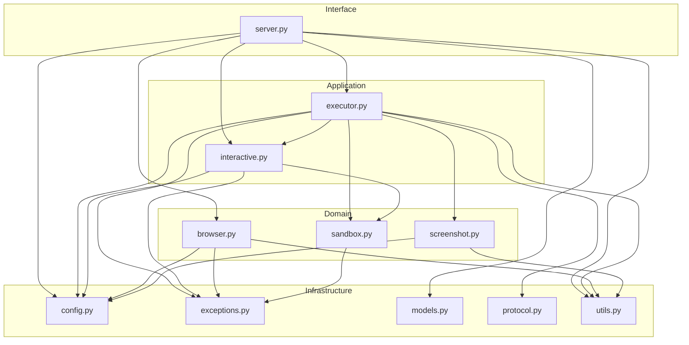

# Web Agent Server — Documentação de Arquitetura

## Índice

1. [Visão Geral](#1-visão-geral)
2. [Estrutura do Projeto](#2-estrutura-do-projeto)
3. [Clean Architecture](#3-clean-architecture)
4. [Fluxo de Execução](#4-fluxo-de-execução)
5. [Módulo a Módulo](#5-módulo-a-módulo)
   - 5.1 [config.py](#51-configpy)
   - 5.2 [exceptions.py](#52-exceptionspy)
   - 5.3 [models.py](#53-modelspy)
   - 5.4 [protocol.py](#54-protocolpy)
   - 5.5 [utils.py](#55-utilspy)
   - 5.6 [sandbox.py](#56-sandboxpy)
   - 5.7 [browser.py](#57-browserpy)
   - 5.8 [interactive.py](#58-interactivepy)
   - 5.9 [screenshot.py](#59-screenshotpy)
   - 5.10 [executor.py](#510-executorpy)
   - 5.11 [server.py](#511-serverpy)
   - 5.12 [run_server.py / send_command.py](#512-run_serverpy--send_commandpy)
6. [Sistema de Segurança](#6-sistema-de-segurança)
7. [Testes](#7-testes)
8. [Variáveis de Ambiente](#8-variáveis-de-ambiente)

---

## 1. Visão Geral

**Web Agent Server** é um servidor de automação web que expõe uma API REST para que agentes de IA (LLMs) controlem um navegador Microsoft Edge remotamente através de comandos Python arbitrários.

A ideia central: em vez de um endpoint fixo para cada ação (`/click`, `/type`, `/navigate`), o servidor recebe código Python bruto, executa-o em um sandbox controlado, e retorna o resultado com uma screenshot automaticamente.

```
Python command → API → Sandbox AST Check → exec/eval → Screenshot → JSON response
```

### Propósito

- Permitir que LLMs naveguem na web de forma autônoma
- Servir como backend MCP-like (Model Context Protocol)
- Executar comandos Selenium sem expor código inseguro

---

## 2. Estrutura do Projeto

```
Argos_MCP_Browser/
│
├── server.py              ★ Endpoints FastAPI (interface REST)
├── executor.py            ★ Orquestrador de comandos
├── browser.py             ★ Gerenciador singleton do Edge
├── sandbox.py             ★ Segurança: AST checker + namespace controlado
├── interactive.py         ★ Sessões interativas multi-usuário
├── screenshot.py          ★ Compressão e limpeza de screenshots
├── models.py               Pydantic models (request/response)
├── protocol.py             Helpers de serialização JSON
├── utils.py                Logging, captura I/O, medição de tempo
├── config.py               Config centralizada via env vars
├── exceptions.py           Hierarquia de exceções customizadas
│
├── requirements.txt        Dependências Python
├── .env                    Config local (não versionado)
│
├── run_server.py           Entry point alternativo
├── send_command.py         Script CLI para testar comandos
│
├── downloads/              Screenshots salvos aqui
│
├── docs/
│   └── ARCHITECTURE.md     ★ Este documento
│
└── tests/
    ├── conftest.py         Fixtures compartilhadas (mocks, fixtures)
    ├── test_browser.py     11 testes — BrowserManager
    ├── test_executor.py    28 testes — CommandExecutor
    ├── test_sandbox.py     27 testes — ASTPreChecker + SafeNamespace
    └── test_api.py         20 testes — API REST (FastAPI TestClient)
```

**Total: 14 módulos Python + 4 suites com 97 testes**

---

## 3. Clean Architecture

O projeto segue o padrão **Clean Architecture** com 4 camadas concêntricas:

```
┌─────────────────────────────────────────────────────────┐
│                    INTERFACE (server.py)                 │
│   FastAPI endpoints, serialização JSON, CORS            │
│   HTTP → Python → JSON                                  │
├─────────────────────────────────────────────────────────┤
│                    APPLICATION (executor, interactive)   │
│   Orquestração de comandos, sessões multi-sessão        │
│   Compilação, timeout, captura de I/O, screenshot       │
├─────────────────────────────────────────────────────────┤
│                    DOMAIN (browser, sandbox, screenshot) │
│   Ciclo de vida do navegador, segurança 3 camadas      │
│   Compressão e retenção de screenshots                  │
├─────────────────────────────────────────────────────────┤
│                    INFRASTRUCTURE (utils, config,        │
│                                    protocol, exceptions) │
│   Logging, helpers, configuração, serialização          │
└─────────────────────────────────────────────────────────┘
```

### Dependências entre camadas

| Camada | Importa de |
|--------|-----------|
| **Interface** | Application + Domain + Infrastructure |
| **Application** | Domain + Infrastructure |
| **Domain** | Infrastructure |
| **Infrastructure** | Nada (apenas stdlib) |

### Diagrama de dependências entre módulos

```
server.py
  ├── browser.py          (Domain)
  ├── executor.py         (Application)
  │     ├── sandbox.py    (Domain)
  │     ├── interactive.py(Application)
  │     ├── screenshot.py (Domain)
  │     ├── protocol.py   (Infra)
  │     └── config.py     (Infra)
  ├── interactive.py      (Application)
  │     └── sandbox.py    (Domain)
  ├── models.py           (Infra)
  └── utils.py            (Infra)

config.py ←─── todos os módulos lêem daqui
exceptions.py ←── sandbox.py, executor.py, interactive.py
utils.py ←─── todos os módulos usam get_logger()
```

---

## 4. Fluxo de Execução

### 4.1 Fluxo completo de um comando

```
                                            ┌──────────────┐
                                            │   Cliente     │
                                            │  (LLM/user)   │
                                            └──────┬───────┘
                                                   │ POST /execute
                                                   │ {"command": "driver.get('...')"}
                                                   ▼
┌──────────────────────────────────────────────────────────────────────┐
│  server.py · execute()                                               │
│  ├── Valida comando não vazio                                        │
│  ├── Verifica se browser está rodando                                │
│  ├── Resolve sessão interativa (se session_id fornecido)             │
│  └── Chama executor.execute_raw()                                    │
└──────────────────────────────────────────────────────────────────────┘
                           │
                           ▼
┌──────────────────────────────────────────────────────────────────────┐
│  executor.py · execute_raw()                                         │
│  └── executor.py · execute()                                         │
│      │                                                               │
│      │  1. LOG: "Executing: <comando>"                               │
│      │                                                               │
│      │  2. executor.py:39 ──── sandbox.py:182 ──── ASTPreChecker    │
│      │     │ Analisa árvore sintática do comando                     │
│      │     │ Bloqueia import, open, os.system, dunder attrs, etc.   │
│      │     │ Se violação → SecurityViolation                         │
│      │                                                               │
│      │  3. executor.py:35-38 ──── Monta namespace                   │
│      │     │ Sem sessão: sandbox.build_safe_namespace(driver)        │
│      │     │ Com sessão: session.get_namespace() (variáveis vivas)  │
│      │                                                               │
│      │  4. executor.py:44-46 ──── Compila                           │
│      │     │ Tenta eval() primeiro, fallback para exec()             │
│      │     │ "1+1" → eval; "x = 1" → exec                           │
│      │                                                               │
│      │  5. executor.py:47-48 ──── Executa em thread separada        │
│      │     │ ThreadPoolExecutor com timeout configurável             │
│      │     │ Captura stdout/stderr via StringIO                      │
│      │     │ Se timeout → CommandTimeoutError                        │
│      │                                                               │
│      │  6. executor.py:76 ──── Screenshot                           │
│      │     │ Captura tela via driver.get_screenshot_as_png()         │
│      │     │ screenshot.ScreenshotManager.capture()                  │
│      │     │ Converte PNG → JPEG, comprime, salva em downloads/     │
│      │                                                               │
│      │  7. executor.py:85-91 ──── Retorna JSON                      │
│      │     │ success=True/False                                      │
│      │     │ result, stdout, stderr, exception, traceback            │
│      │     │ execution_time, screenshot_path                         │
│      └─────────────────────────────────────────────────────────┘
                           │
                           ▼
┌──────────────────────────────────────────────────────────────────────┐
│  server.py · execute()                                               │
│  ├── browser.increment_commands() (se success)                       │
│  └── HTTP 200 + JSON                                                 │
└──────────────────────────────────────────────────────────────────────┘
```

### 4.2 Fluxo de segurança

```
Comando cru (string)
       │
       ▼
┌──────────────────────┐
│  1. ASTPreChecker    │ ←─── Pré-verificação ANTES de compilar
│  (sandbox.py:182)    │      Analisa árvore sintática (ast.parse)
│                      │      Bloqueia: import, open(), os.system(),
│                      │      getattr(), __class__, etc.
│  Se violação         │
│  → SecurityViolation │
└──────────────────────┘
       │ (passou)
       ▼
┌──────────────────────┐
│  2. Namespace        │ ←─── Ambiente controlado
│  (sandbox.py:173)    │      Apenas objetos autorizados
│                      │      Sem __import__, sem subprocess
│                      │      Builtins: só os seguros
└──────────────────────┘
       │ (passou)
       ▼
┌──────────────────────┐
│  3. ThreadPoolExecutor│ ←─── Timeout forçado
│  (executor.py:137)   │      Se execução exceder X segundos
│                      │      → CommandTimeoutError
│                      │      Thread é cancelada
└──────────────────────┘
       │ (passou)
       ▼
   Código executado com segurança
```

---

## 5. Módulo a Módulo

### 5.1 config.py

**Arquivo:** `config.py` (39 linhas)
**Camada:** Infrastructure
**Propósito:** Centraliza todas as configurações do sistema via variáveis de ambiente.

**Como funciona:**

```python
load_dotenv()  # Carrega .env automaticamente

class Settings:
    PROJECT_ROOT = Path(__file__).parent  # Diretório raiz do projeto
    DOWNLOAD_DIR = PROJECT_ROOT / "downloads"
    HOST: str = os.getenv("HOST", "127.0.0.1")
    PORT: int = int(os.getenv("PORT", "8000"))
    HEADLESS: bool = os.getenv("HEADLESS", "false").lower() == "true"
    ...
```

**Onde é usado:** Todos os módulos importam `from config import settings`.

**Variáveis expostas:**

| Variável | Tipo | Default | Descrição |
|----------|------|---------|-----------|
| `HOST` | str | `127.0.0.1` | Endereço do servidor |
| `PORT` | int | `8000` | Porta HTTP |
| `HEADLESS` | bool | `false` | Modo headless do Edge |
| `LOG_LEVEL` | str | `INFO` | Nível de logging |
| `EDGE_DRIVER_PATH` | str | `""` | Caminho customizado do edgedriver |
| `WINDOW_WIDTH` | int | `1280` | Largura da janela |
| `WINDOW_HEIGHT` | int | `800` | Altura da janela |
| `IMPLICIT_WAIT` | float | `2` | Espera implícita do Selenium (s) |
| `PAGE_LOAD_TIMEOUT` | float | `30` | Timeout de carregamento (s) |
| `SCRIPT_TIMEOUT` | float | `10` | Timeout de script (s) |
| `COMMAND_TIMEOUT` | float | `60` | Timeout máximo por comando (s) |
| `MAX_SESSION_VARIABLES` | int | `1000` | Limite de variáveis por sessão |
| `SCREENSHOT_QUALITY` | int | `70` | Qualidade JPEG (1-100) |
| `SCREENSHOT_FORMAT` | str | `jpeg` | Formato: `jpeg` ou `png` |
| `SCREENSHOT_RETENTION_DAYS` | int | `7` | Dias para manter screenshots |
| `SCREENSHOT_CLEANUP_INTERVAL_MINUTES` | int | `60` | Intervalo entre limpezas |

**Importante:** `settings.DOWNLOAD_DIR.mkdir(parents=True, exist_ok=True)` roda na importação, garantindo que o diretório `downloads/` existe antes de qualquer operação.

---

### 5.2 exceptions.py

**Arquivo:** `exceptions.py` (35 linhas)
**Camada:** Infrastructure
**Propósito:** Hierarquia de exceções customizadas.

**Árvore de herança:**

```
Exception
├── BrowserError
│   ├── BrowserNotStartedError     → "Browser not started. Call start() first."
│   └── BrowserAlreadyStartedError → "Browser already started."
├── ExecutionError
│   ├── SecurityViolation          → "Security violation detected."
│   └── CommandTimeoutError        → "Command timed out after Xs"
└── SessionError
    └── SessionNotFoundError       → "Session 'X' not found"
```

**Onde são levantadas:**

| Exceção | Levantada em | Capturada em |
|----------|------------|------------|
| `BrowserNotStartedError` | `browser.py:44, 132` | — |
| `BrowserAlreadyStartedError` | `browser.py:106` | — |
| `SecurityViolation` | `sandbox.py:210, 215, 223, 231, 241, 248, 256` | `executor.py:101` |
| `CommandTimeoutError` | `executor.py:142` | `executor.py:115` |
| `SessionNotFoundError` | `interactive.py:79` | `server.py:110, 153` |

---

### 5.3 models.py

**Arquivo:** `models.py` (38 linhas)
**Camada:** Infrastructure
**Propósito:** Define os contratos de entrada e saída da API usando Pydantic v2.

**Modelos:**

```python
class ExecuteRequest(BaseModel):
    command: str           # Código Python a executar (obrigatório, min 1 char)
    session_id: str | None # ID da sessão interativa (opcional)

class ExecuteResponse(BaseModel):
    success: bool                       # True/False
    result: Any = None                  # Resultado da expressão
    stdout: str = ""                    # Tudo que foi printado
    stderr: str = ""                    # Erros capturados
    exception: str | None = None        # Mensagem da exceção
    traceback: str | None = None        # Stack trace completo
    execution_time: float = 0.0         # Tempo em segundos
    screenshot_path: str | None = None  # Caminho do screenshot

class StatusResponse(BaseModel):
    browser_running: bool       # Edge está ativo?
    active_sessions: list[str]  # Sessões ativas
    commands_executed: int      # Total de comandos bem-sucedidos
    uptime_seconds: float       # Tempo desde o start do browser
    pid: int | None = None      # PID do processo Edge

class HealthResponse(BaseModel):
    status: str = "ok"
    version: str = "0.1.0"

class SessionCreateResponse(BaseModel):
    session_id: str
    message: str = "Session created"
```

**Como são usados:** FastAPI usa os models para validação automática, serialização JSON, e documentação OpenAPI/Swagger.

---

### 5.4 protocol.py

**Arquivo:** `protocol.py` (49 linhas)
**Camada:** Infrastructure
**Propósito:** Helpers que constroem objetos `ExecuteResponse` de forma padronizada.

**Funções:**

```python
def success_response(result, stdout, stderr, execution_time, screenshot_path) -> ExecuteResponse
def error_response(exception, traceback_str, execution_time) -> ExecuteResponse
def _serialize(obj) -> Any  # Serialização recursiva para JSON
```

**Serialização (`_serialize`):**

| Tipo de entrada | Saída |
|----------------|-------|
| `None` | `None` |
| `str, int, float, bool` | Mantém o tipo |
| `list, tuple` | Serializa cada item |
| `dict` | Converte chaves para str, serializa valores |
| Qualquer outro | `str(obj)` ou `repr(obj)` |

**Isso garante que** mesmo objetos Selenium como `WebElement` não quebrem o JSON — eles viram string via `str()`.

---

### 5.5 utils.py

**Arquivo:** `utils.py` (54 linhas)
**Camada:** Infrastructure
**Propósito:** Utilitários compartilhados por todos os módulos.

**Componentes:**

#### `get_logger(name)`
- Cria um logger com formato timestamp + nível + nome + mensagem
- Usa `settings.LOG_LEVEL` para definir o nível
- Singleton implícito: só adiciona handler se não houver nenhum

**Saída:**
```
2026-06-23 18:10:40 | INFO     | executor | Executing: 1+1
2026-06-23 18:10:40 | WARNING  | browser  | Could not start browser: ...
```

#### `capture_output()`
- Context manager (`with capture_output() as get_captured:`)
- Redireciona `sys.stdout` e `sys.stderr` para `StringIO`
- Retorna um callable que quando chamado devolve `(stdout_capture, stderr_capture)`
- Restaura os streams originais no `finally`

#### `time_context()`
- Context manager (`with time_context() as elapsed:`)
- Registra `time.perf_counter()` na entrada
- Retorna um callable que quando chamado devolve `time.perf_counter() - start`

#### `truncate(text, max_len=500)`
- Corta texto longo com `...`

---

### 5.6 sandbox.py

**Arquivo:** `sandbox.py` (274 linhas)
**Camada:** Domain
**Propósito:** Coração do sistema de segurança. Duas defesas independentes.

---

#### 5.6.1 SafeNamespace (`build_safe_namespace()`)

**O que faz:** Monta um dicionário Python que servirá de namespace para `exec()`/`eval()`.

```python
def build_safe_namespace(driver) -> dict:
    namespace = {**ALLOWED_NAMES}
    namespace["driver"] = driver
    namespace["__builtins__"] = _safe_builtins()
    return namespace
```

**Objetos disponíveis no namespace (`ALLOWED_NAMES`):**

| Categoria | Objetos |
|-----------|---------|
| **Selenium** | `By`, `Keys`, `EC`, `WebDriverWait`, `ActionChains`, `Select` |
| **Exceções Selenium** | `NoSuchElementException`, `TimeoutException`, `JavascriptException` |
| **Tempo** | `time` (módulo), `sleep` (função) |
| **Stdlib** | `re`, `json`, `os` (apenas atributos seguros), `pathlib` (Path), `datetime` |
| **Browser** | `driver` (injetado dinamicamente) |

**Builtins permitidos (`ALLOWED_BUILTIN_NAMES`):**

94 nomes, incluindo:
- Tipos: `int`, `float`, `str`, `bool`, `list`, `dict`, `set`, `tuple`
- Funções: `len`, `range`, `enumerate`, `zip`, `map`, `filter`, `sorted`, `print`
- Matemática: `min`, `max`, `sum`, `abs`, `round`
- Intropecção limitada: `type`, `isinstance`, `hasattr`
- Exceções: `Exception`, `ValueError`, `TypeError`, `KeyError`, `IndexError`, etc.
- Meta: `super`, `object`, `property`, `classmethod`, `staticmethod`
- Iteração: `iter`, `next`, `callable`

**Total de builtins bloqueados comparado ao Python real:** ~70% dos builtins padrão são removidos.

---

#### 5.6.2 ASTPreChecker

**O que faz:** Analisa o código-fonte como árvore sintática abstrata (AST) **antes** da execução e bloqueia construções perigosas.

**Técnica:** `ast.parse(command, mode="exec")` → `ast.walk(tree)` → inspeção de cada nó.

**Três verificações independentes:**

##### `_check_import(node)` — Bloqueio de imports

```python
for alias in node.names:
    root = alias.name.split(".")[0]
    if root in BLOCKED_ROOTS:    # subprocess, socket, ctypes, shutil, etc.
        raise SecurityViolation
    if root == "os":             # "import os" bloqueado, usar 'os' já fornecido
        raise SecurityViolation
```

**Roots bloqueados:** `subprocess`, `socket`, `ctypes`, `pickle`, `shutil`, `signal`, `multiprocessing`, `threading` + `os`

##### `_check_call(node)` — Bloqueio de chamadas de função

```python
if node.func.id in BLOCKED_CALL_NAMES:
    raise SecurityViolation
```

**Funções bloqueadas:** `__import__`, `open`, `exec`, `eval`, `compile`, `breakpoint`, `input`, `vars`, `dir`, `globals`, `locals`, `memoryview`, `bytearray`, `getattr`, `setattr`, `delattr`

Também verifica chains de atributos como `os.system(...)`, `os.popen(...)`.

##### `_check_attribute(node)` — Bloqueio de atributos dunder

```python
if node.attr in BLOCKED_DUNDER_ATTRS:
    raise SecurityViolation
```

**Atributos bloqueados:** `__builtins__`, `__class__`, `__base__`, `__subclasses__`, `__globals__`, `__code__`, `__closure__`, `__func__`, `__self__`, `__dict__`, `__mro__`, `__bases__`

**Cobertura:** Bloqueia tanto acesso direto (`driver.__class__`) quanto em cadeia (`driver.__class__.__subclasses__()`).

##### `_resolve_attr_chain(node)` — Utilitário interno

Percorre a AST reconstruindo a cadeia de atributos. Ex:
- `os.system("cmd")` → `["os", "system"]`
- `driver.__class__.__subclasses__()` → `["driver", "__class__", "__subclasses__"]`

---

### 5.7 browser.py

**Arquivo:** `browser.py` (151 linhas)
**Camada:** Domain
**Propósito:** Gerencia o ciclo de vida de uma única instância do Microsoft Edge via Selenium.

---

#### 5.7.1 Singleton

```python
class BrowserManager:
    _instance: BrowserManager | None = None
    _lock: threading.Lock = threading.Lock()

    def __new__(cls) -> BrowserManager:
        if cls._instance is None:
            with cls._lock:
                if cls._instance is None:
                    cls._instance = super().__new__(cls)
                    cls._instance._initialized = False
        return cls._instance
```

**Thread-safe double-checked locking.** Garante que existe exatamente um `BrowserManager` e um Edge em todo o processo.

#### 5.7.2 Propriedades

| Propriedade | Descrição |
|------------|-----------|
| `driver` | Retorna o WebDriver ou levanta `BrowserNotStartedError` |
| `is_running` | Verifica se o driver responde (tenta acessar `current_url`) |
| `commands_executed` | Contador de comandos bem-sucedidos |
| `uptime_seconds` | Tempo desde `start()` (via `time.time()`) |

#### 5.7.3 Opções do Edge (`_build_options`)

```python
options = Options()
options.add_argument("--window-size=1280,800")
options.add_argument("--disable-gpu")
options.add_argument("--no-sandbox")
options.add_argument("--disable-dev-shm-usage")
options.add_argument("--disable-blink-features=AutomationControlled")
options.add_argument("--remote-debugging-port=0")
# + prefs para download automático, sem popups, sem senhas
```

**O que cada flag faz:**

| Flag | Propósito |
|------|-----------|
| `--headless=new` | Modo headless (se HEADLESS=true) |
| `--window-size=WxH` | Tamanho da janela |
| `--disable-gpu` | Desabilita aceleração GPU (útil em servidores) |
| `--no-sandbox` | Desabilita sandbox do Chrome (necessário em containers) |
| `--disable-dev-shm-usage` | Evita problemas de memória `/dev/shm` |
| `--disable-extensions` | Remove extensões que podem interferir |
| `--disable-background-tasks` | Reduz consumo em background |
| `--disable-blink-features=AutomationControlled` | Remove flag de automação do `navigator` |
| `--disable-popup-blocking` | Permite popups (Azure Portal usa) |
| `--remote-debugging-port=0` | Porta aleatória para DevTools |

**Preferências (`prefs`):**
- `download.default_directory` → diretório `downloads/`
- `download.prompt_for_download` → `False` (download automático)
- `credentials_enable_service` → `False` (sem gerenciador de senhas)

**Experimental options:**
- `excludeSwitches: ["enable-automation"]` → remove badge "controlado por automação"
- `useAutomationExtension: False` → desabilita extensão de automação

#### 5.7.4 Métodos principais

| Método | Ação |
|--------|------|
| `start(edge_driver_path)` | Inicia Edge, retorna WebDriver |
| `stop()` | Fecha Edge (`driver.quit()`) |
| `restart(edge_driver_path)` | Stop + Start |
| `increment_commands()` | Incrementa contador |

**Tratamento de erros:**
- `start()` duas vezes → `BrowserAlreadyStartedError`
- `stop()` sem start → `BrowserNotStartedError`
- `restart()` sem start → funciona como `start()`
- `is_running` captura exceções → retorna `False` se tab crashou

---

### 5.8 interactive.py

**Arquivo:** `interactive.py` (99 linhas)
**Camada:** Application
**Propósito:** Sessões interativas que persistem variáveis entre múltiplos comandos.

---

#### 5.8.1 InteractiveSession

Cada sessão é um UUID único com seu próprio namespace.

```python
class InteractiveSession:
    def __init__(self, session_id):
        self._scope = {**ALLOWED_NAMES, "__builtins__": _safe_builtins()}
        # driver será injetado depois
```

**Métodos:**

| Método | Descrição |
|--------|-----------|
| `inject_driver(driver)` | Thread-safe: adiciona/atualiza `driver` no namespace |
| `get_namespace()` | Retorna o dicionário para `exec()`/`eval()` |
| `increment_commands()` | Thread-safe: contador de comandos |
| `cleanup()` | Remove variáveis criadas pelo usuário, preserva `ALLOWED_NAMES` |

**Cleanup:** Remove apenas as chaves que não são `ALLOWED_NAMES` ou `__builtins__`, mantendo o namespace limpo.

#### 5.8.2 SessionManager

Gerencia múltiplas sessões simultâneas.

| Método | Descrição |
|--------|-----------|
| `create_session()` | UUID4 → `InteractiveSession` |
| `get_session(id)` | Retorna ou `SessionNotFoundError` |
| `delete_session(id)` | Remove e faz cleanup |
| `inject_driver_to_all(driver)` | Útil no restart — atualiza driver em todas |
| `cleanup_all()` | Limpa todas as sessões (usado no shutdown) |
| `active_sessions` | Lista de IDs ativos |

**Thread-safety:** Todas as operações de leitura/escrita no dicionário são protegidas por `threading.Lock`.

---

### 5.9 screenshot.py

**Arquivo:** `screenshot.py` (102 linhas)
**Camada:** Domain
**Propósito:** Captura, compressão e limpeza automática de screenshots.

---

#### 5.9.1 ScreenshotManager

```python
class ScreenshotManager:
    def __init__(self):
        self._quality = 70                # Qualidade JPEG (1-100)
        self._fmt = "jpeg"                # Formato: jpeg ou png
        self._retention_days = 7          # Dias de retenção
        self._cleanup_interval = 60       # Minutos entre limpezas
```

##### `capture(driver)`

1. Obtém screenshot como PNG bruto via `driver.get_screenshot_as_png()`
2. Abre com PIL.Image
3. Se RGBA → converte para RGB (fundo branco)
4. Salva como JPEG com `optimize=True` ou PNG com `optimize=True`

**Tamanhos típicos para 1920×1080:**

| Formato/Qualidade | Tamanho aproximado |
|------------------|-------------------|
| PNG (Selenium raw) | ~300-500 KB |
| JPEG quality=70 | ~30-50 KB |
| JPEG quality=30 | ~10-15 KB |

##### `cleanup()`

Varre `downloads/` por arquivos `screenshot_*`, compara `st_mtime` com `now - retention_days`, remove os antigos.

##### `start_background_cleanup()`

- Executa um cleanup inicial
- Inicia thread daemon que roda `cleanup()` a cada `cleanup_interval` minutos
- Usa `threading.Event.wait()` para intervals sem busy-wait

##### `stop_background_cleanup()`

Sinaliza parada via `Event.set()` e aguarda thread finalizar (timeout 5s).

#### 5.9.2 Integração

- `executor.py` instancia `ScreenshotManager` no `__init__`
- `executor._try_save_screenshot()` delega para `capture()`
- `server.py` chama `start_background_cleanup()` no startup e `stop_background_cleanup()` no shutdown

---

### 5.10 executor.py

**Arquivo:** `executor.py` (152 linhas)
**Camada:** Application
**Propósito:** Orquestra a execução de comandos Python com segurança, timeout e captura de saída.

---

#### 5.10.1 CommandExecutor

```python
class CommandExecutor:
    def __init__(self, timeout=60):
        self._timeout = timeout
        self._pool = ThreadPoolExecutor(max_workers=1)
        self._screenshot_mgr = ScreenshotManager()
```

#### 5.10.2 Método `execute()`

Fluxo detalhado:

```
1. Log                     → "Executing: <comando>"
2. ASTPreChecker.check()   → Levanta SecurityViolation se perigoso
3. Namespace               → Session.get_namespace() ou build_safe_namespace(driver)
4. Inject driver           → Session.inject_driver() (se sessão)
5. Compile                 → Tenta eval(), fallback exec()
6. ThreadPoolExecutor      → Executa código com timeout
7. Captura I/O             → StringIO para stdout/stderr
8. Screenshot              → ScreenshotManager.capture()
9. Retorna                 → success_response() com tudo
```

**Tratamento de erros no `execute()`:**

| Erro | Comportamento |
|------|---------------|
| `SecurityViolation` | Relança (capturado no `execute_raw`) |
| `SyntaxError` | Retorna `error_response` com mensagem |
| `CommandTimeoutError` | Relança (capturado no `execute_raw`) |
| `Exception` genérico | Retorna `error_response` com traceback |

#### 5.10.3 Método `execute_raw()`

Wrapper que captura **todas** as exceções e sempre retorna JSON:
- `SecurityViolation` → erro com "not allowed"
- `SyntaxError` → erro de sintaxe
- `CommandTimeoutError` → timeout
- Qualquer outra → retorna como erro

**Isso garante que** a API nunca quebra: `execute_raw()` só retorna dicionários.

#### 5.10.4 Compilação inteligente (`_compile()`)

```python
def _compile(self, command):
    for mode in ("eval", "exec"):
        try:
            code = compile(command, "<command>", mode)
            return code, mode
        except SyntaxError:
            continue
    raise SyntaxError(...)
```

**Por que eval primeiro?**
- `eval("1+1")` → retorna `2` (útil para expressões)
- `exec("1+1")` → retorna `None` (não retorna resultado)
- Se `eval` falha (ex: `x = 1` não é válido em eval), tenta `exec`

#### 5.10.5 Execução em thread (`_run_in_thread()`)

```python
future = self._pool.submit(self._execute_code, code, mode, namespace)
return future.result(timeout=self._timeout)
```

- Usa `ThreadPoolExecutor` com 1 worker (fila serializada)
- Timeout via `future.result(timeout=...)`
- Se estourar: `future.cancel()` + `CommandTimeoutError`

---

### 5.11 server.py

**Arquivo:** `server.py` (172 linhas)
**Camada:** Interface
**Propósito:** Servidor FastAPI que expõe os endpoints REST.

---

#### 5.11.1 Singletons (módulo-level)

```python
browser = BrowserManager()
session_manager = SessionManager()
executor = CommandExecutor()
```

**Por que singletons globais?**
- `browser`: só pode haver um Edge
- `session_manager`: centraliza as sessões
- `executor`: reusa o ThreadPool

#### 5.11.2 Lifespan (startup/shutdown)

```python
@asynccontextmanager
async def lifespan(app):
    # Startup
    driver = browser.start()
    session_manager.inject_driver_to_all(driver)
    executor._screenshot_mgr.start_background_cleanup()
    yield
    # Shutdown
    executor._screenshot_mgr.stop_background_cleanup()
    session_manager.cleanup_all()
    browser.stop()
```

#### 5.11.3 Endpoints

| Método | Rota | Request | Response |
|--------|------|---------|----------|
| `GET` | `/health` | — | `{status, version}` |
| `GET` | `/status` | — | `{browser, sessions, commands, uptime, pid}` |
| `POST` | `/execute` | `{command, session_id?}` | `{success, result, stdout, ...}` |
| `POST` | `/restart` | — | `{message}` |
| `POST` | `/close` | — | `{message}` |
| `POST` | `/session` | — | `{session_id}` |
| `DELETE` | `/session/{id}` | — | `{message}` |

##### POST /execute — Detalhado

```python
@app.post("/execute")
async def execute(req: ExecuteRequest):
    # 1. Validação do comando
    if not req.command.strip():
        raise HTTPException(422, "Command cannot be empty")

    # 2. Verifica browser
    if not browser.is_running:
        raise HTTPException(503, "Browser is not running")

    # 3. Resolve sessão (se fornecida)
    if req.session_id:
        session = session_manager.get_session(req.session_id)

    # 4. Executa
    result = executor.execute_raw(command, driver, session)

    # 5. Contabiliza
    if result.get("success"):
        browser.increment_commands()

    return ExecuteResponse(**result)
```

##### CORS

```python
app.add_middleware(
    CORSMiddleware,
    allow_origins=["*"],
    allow_credentials=True,
    allow_methods=["*"],
    allow_headers=["*"],
)
```

#### 5.11.4 Entry point

```python
def main():
    import uvicorn
    uvicorn.run("server:app", host=settings.HOST, port=settings.PORT, reload=False)
```

---

### 5.12 run_server.py / send_command.py

**Arquivo:** `run_server.py` (9 linhas)

Entry point alternativo que faz apenas `uvicorn.run("server:app")`. Útil para execução direta.

**Arquivo:** `send_command.py` (24 linhas)

Script CLI que lê um comando Python do stdin, envia para o servidor e imprime o JSON de resposta.

**Uso:**
```bash
echo "driver.get('https://google.com')" | python send_command.py
```

---

## 6. Sistema de Segurança

### 6.1 As 3 camadas

| Camada | Onde | O que bloqueia | Como |
|--------|------|----------------|------|
| **1. AST PreChecker** | `sandbox.py:182` | Imports perigosos, `open()`, `os.system()`, dunders, `getattr()` | `ast.parse()` + `ast.walk()` |
| **2. SafeNamespace** | `sandbox.py:173` | `__import__`, `subprocess`, `socket`, exec/eval dentro do código | Namespace controlado sem builtins perigosos |
| **3. ThreadPoolExecutor** | `executor.py:137` | Loop infinito, código lento | `future.result(timeout=X)` |

### 6.2 O que é bloqueado

**Imports bloqueados:**
`subprocess`, `socket`, `ctypes`, `pickle`, `shutil`, `signal`, `multiprocessing`, `threading`, `os`

**Chamadas bloqueadas:**
`__import__()`, `open()`, `exec()`, `eval()`, `compile()`, `breakpoint()`, `input()`, `vars()`, `dir()`, `globals()`, `locals()`, `memoryview()`, `bytearray()`, `getattr()`, `setattr()`, `delattr()`

**Atributos bloqueados:**
`__builtins__`, `__class__`, `__base__`, `__subclasses__`, `__globals__`, `__code__`, `__closure__`, `__func__`, `__self__`, `__dict__`, `__mro__`, `__bases__`

**Cadeias de atributos bloqueadas:**
`os.system`, `os.popen`, `os.startfile`, `os.exec*`, `os.fork`, `os.kill`, `os.spawn*`, `subprocess.*`, `socket.*`, `ctypes.*`, `pickle.*`, `shutil.*`, `signal.*`, `multiprocessing.*`, `threading.*`

### 6.3 O que está disponível

**Selenium:** `driver`, `By`, `Keys`, `EC`, `WebDriverWait`, `ActionChains`, `Select`, `NoSuchElementException`, `TimeoutException`, `JavascriptException`

**Stdlib:** `time`, `sleep`, `re`, `json`, `os` (limitado), `pathlib` (só Path), `datetime`

**Builtins seguros:** `print`, `len`, `str`, `int`, `float`, `bool`, `list`, `dict`, `set`, `tuple`, `range`, `enumerate`, `zip`, `map`, `filter`, `min`, `max`, `sum`, `abs`, `round`, `sorted`, `reversed`, `any`, `all`, `isinstance`, `type`, `hasattr`, `Exception` + 30+ outros

### 6.4 Limitações conhecidas

- `import json` → **FALHA** porque `__import__` é removido dos builtins. Use o `json` já disponível no namespace.
- `os.getcwd()` → funciona (não está na blocklist)
- `os.environ` → funciona (não está na blocklist)
- O AST PreChecker analisa o comando como string, não a execução em si. Código que gere código dinamicamente dentro do sandbox não seria pego, mas como `exec`/`eval`/`compile` estão bloqueados no namespace, isso não é possível.

---

## 7. Testes

### 7.1 Estrutura

```
tests/
├── __init__.py
├── conftest.py              # Fixtures: mock_driver, browser_manager, executor, etc.
├── test_browser.py          # TestBrowserManager: 11 testes
├── test_executor.py         # TestCommandExecutor: 28 testes
├── test_sandbox.py          # TestBuildSafeNamespace + TestASTPreChecker: 27 testes
└── test_api.py              # TestHealth, TestStatus, TestExecute, TestSession, etc: 20 testes
```

**Total: 97 testes, 0 falhas.**

### 7.2 Fixtures (conftest.py)

| Fixture | Tipo | Propósito |
|---------|------|-----------|
| `mock_driver` | MagicMock | Simula WebDriver para testes unitários |
| `browser_manager` | BrowserManager | Instância limpa (sem driver) |
| `started_browser` | BrowserManager | Browser com mock_driver injetado |
| `command_executor` | CommandExecutor | Executor com timeout 5s |
| `session_manager` | SessionManager | Gerenciador limpo |
| `safe_namespace` | dict | Namespace com mock_driver |
| `api_client` | TestClient | Cliente HTTP com started_browser |

### 7.3 Suítes de teste

#### test_browser.py (11 testes)

| Teste | O que verifica |
|-------|---------------|
| `test_singleton` | `BrowserManager()` sempre retorna mesma instância |
| `test_initial_state` | `is_running=False`, `uptime=0`, `commands=0` |
| `test_get_driver_before_start_raises` | `BrowserNotStartedError` |
| `test_start_success` | Start cria driver, configura timeouts |
| `test_double_start_raises` | `BrowserAlreadyStartedError` |
| `test_stop_success` | Stop chama `quit()`, zera estado |
| `test_stop_before_start_raises` | `BrowserNotStartedError` |
| `test_restart` | Restart chama quit e start |
| `test_increment_commands` | Contador funciona |
| `test_edge_options` | `_build_options()` retorna Options |
| `test_is_running_returns_false_on_exception` | Se `current_url` falha → `is_running=False` |

#### test_executor.py (28 testes)

| Grupo | Testes | O que verifica |
|-------|--------|---------------|
| **Eval** | 2 | Expressões (`1+1`, `"a"*3`) retornam resultado |
| **Exec** | 4 | Statements (`x=1`), `print`, múltiplas linhas |
| **Stdout/Stderr** | 3 | Captura correta de saída e erro |
| **Erros** | 5 | SyntaxError, NameError, ZeroDivisionError, HTTPError, AttributeError |
| **Timeout** | 3 | Timeout bloqueia (`sleep(10)`) e não afeta comandos rápidos |
| **Screenshot** | 1 | Screenshot_path não nulo após execução |
| **Sessão** | 5 | Variáveis persistem entre chamadas, driver injetado |
| **Segurança** | 5 | `open()`, `os.system()`, `getattr()`, `subprocess`, `__class__` bloqueados |

#### test_sandbox.py (27 testes)

| Grupo | Testes | O que verifica |
|-------|--------|---------------|
| **SafeNamespace** | 6 | Driver, Selenium, stdlib, builtins seguros, builtins bloqueados |
| **AST: Allow** | 11 | Comandos legítimos passam |
| **AST: Block Import** | 4 | `import subprocess`, `import socket`, `import ctypes`, `from subprocess import Popen` |
| **AST: Block Call** | 8 | `open()`, `exec()`, `eval()`, `compile()`, `input()`, `os.system()`, `os.popen()`, `breakpoint()` |
| **AST: Block Dunder** | 3 | `driver.__class__`, `__subclasses__()`, `getattr()` |
| **AST: SyntaxError** | 1 | Erro de sintaxe não causa crash |

#### test_api.py (20 testes)

| Grupo | Testes | O que verifica |
|-------|--------|---------------|
| **Health** | 1 | `GET /health` retorna `{status: "ok"}` |
| **Status** | 3 | Status com/sem browser, estrutura do response |
| **Execute** | 9 | Sucesso, sessão, erro, sem browser, comando vazio, sessão inválida, driver.get, driver.title, violação de segurança |
| **Session** | 4 | Criar, deletar, deletar inexistente, múltiplas sessões |
| **Restart/Close** | 3 | Restart sucesso, close sucesso, close sem browser |

### 7.4 Como rodar

```bash
# Todos os testes
pytest

# Com verbose
pytest -v

# Suíte específica
pytest tests/test_sandbox.py -v

# Teste específico
pytest tests/test_sandbox.py::TestASTPreChecker::test_blocks_open_call -v

# Com cobertura
pytest --cov=. tests/
```

---

## 8. Variáveis de Ambiente

Todas as configurações são definidas em `config.py` com valores default. Um arquivo `.env` na raiz pode sobrescrevê-las.

### 8.1 Tabela completa

| Variável | Default | Tipo | Descrição |
|----------|---------|------|-----------|
| **Servidor** | | | |
| `HOST` | `127.0.0.1` | str | Endereço do servidor |
| `PORT` | `8000` | int | Porta HTTP |
| `LOG_LEVEL` | `INFO` | str | `DEBUG`, `INFO`, `WARNING`, `ERROR` |
| **Navegador** | | | |
| `HEADLESS` | `false` | bool | Rodar Edge sem janela visível |
| `EDGE_DRIVER_PATH` | `""` | str | Caminho customizado do msedgedriver |
| `WINDOW_WIDTH` | `1280` | int | Largura da janela em pixels |
| `WINDOW_HEIGHT` | `800` | int | Altura da janela em pixels |
| `IMPLICIT_WAIT` | `2` | float | Espera implícita do Selenium (s) |
| `PAGE_LOAD_TIMEOUT` | `30` | float | Timeout de carregamento de página (s) |
| `SCRIPT_TIMEOUT` | `10` | float | Timeout de script JS (s) |
| **Execução** | | | |
| `COMMAND_TIMEOUT` | `60` | float | Timeout máximo por comando (s) |
| `MAX_SESSION_VARIABLES` | `1000` | int | Limite de variáveis por sessão |
| **Screenshots** | | | |
| `SCREENSHOT_QUALITY` | `70` | int | Qualidade JPEG (1-100) |
| `SCREENSHOT_FORMAT` | `jpeg` | str | `jpeg` ou `png` |
| `SCREENSHOT_RETENTION_DAYS` | `7` | int | Dias antes de deletar screenshots |
| `SCREENSHOT_CLEANUP_INTERVAL_MINUTES` | `60` | int | Minutos entre limpezas |

### 8.2 Exemplo de .env

```env
# ─── Servidor ──────────────────────
HOST=127.0.0.1
PORT=8000
LOG_LEVEL=INFO

# ─── Navegador ─────────────────────
HEADLESS=false
WINDOW_WIDTH=1280
WINDOW_HEIGHT=800
IMPLICIT_WAIT=2
PAGE_LOAD_TIMEOUT=30
SCRIPT_TIMEOUT=10

# ─── Execução ──────────────────────
COMMAND_TIMEOUT=60
MAX_SESSION_VARIABLES=1000

# ─── Screenshots ───────────────────
SCREENSHOT_QUALITY=70
SCREENSHOT_FORMAT=jpeg
SCREENSHOT_RETENTION_DAYS=7
SCREENSHOT_CLEANUP_INTERVAL_MINUTES=60
```

---

## Diagrama de Dependências (Mermaid)



---

*Documentação gerada em 23/06/2026. Projeto Web Agent Server v0.1.0.*
